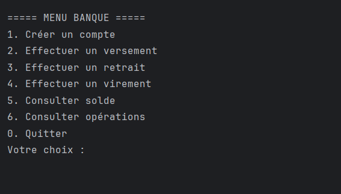
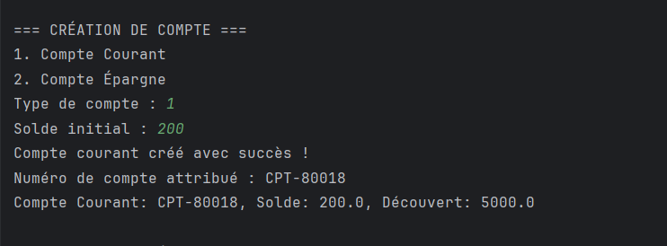
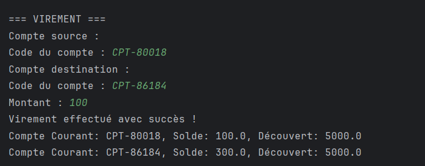

# BankOne

## Description du projet
BankOne est une application console Java permettant à une banque de gérer ses comptes bancaires et opérations associées (versements, retraits, virements). L'application respecte une architecture en couches (présentation, métier, utilitaire) et assure la gestion sécurisée et interactive des comptes courants et épargne.

## Technologies utilisées
- Java 8 (JDK 1.8)
- API Java Time (gestion des dates)
- Collections Java (`ArrayList`, `HashMap`)
- Git (contrôle de version)
- JIRA (gestion des tâches)

## Structure du projet
```
BankOnee/
│
├── src/
│   ├── BanqueApp.java         # Couche présentation (UI/Menu)
│   ├── Main.java              # Point d'entrée possible
│   ├── banque/
│   │   ├── Compte.java            # Classe abstraite métier
│   │   ├── CompteCourant.java     # Compte courant
│   │   └── CompteEpargne.java     # Compte épargne
│   └── operations/
│       ├── Operation.java     # Classe abstraite opération
│       ├── Versement.java     # Versement
│       └── Retrait.java       # Retrait
│
└── README.md
```

## Prérequis
- JDK 8 installé
- Git installé
- Terminal ou invite de commandes

## Compilation et exécution
```bash
# Compilation
javac -d bin src/banque/*.java src/operations/*.java src/*.java

# Exécution
java -cp bin BanqueApp
```

## Fonctionnalités principales
- Création de comptes (courant ou épargne)
- Versement, retrait, virement entre comptes
- Consultation du solde et des opérations
- Validation des entrées utilisateur (montants, format du code compte)
- Gestion des exceptions

## Captures d'écran

*Menu principal :*


*Création d'un compte :*


*Consultation des opérations :*


---

**NB :** Les données sont stockées en mémoire et perdues à la fermeture de l'application.  
Le projet respecte les bonnes pratiques d'architecture logicielle (séparation des couches, encapsulation, etc.).
